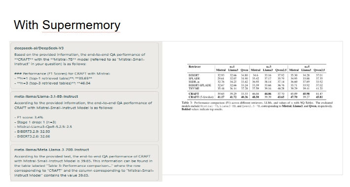
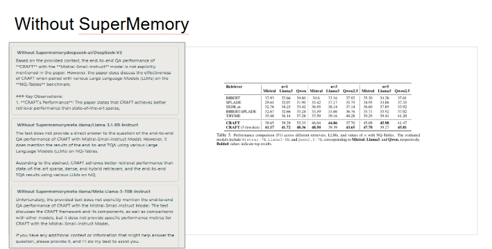

 
# SLM-based-QA




**SLM-based-QA** is a Flask-based Question Answering system over PDF documents that demonstrates how **retrieval-augmented generation (RAG)** using **Supermemory** improves answer quality when compared to direct prompting of Small / Large Language Models (SLMs/LLMs).

The system allows users to upload a PDF, index it into Supermemory, and query it using multiple Hugging Face–hosted models, returning answers **with** and **without** retrieval context for direct comparison.

 

## ✨ Key Features

- PDF upload and text extraction
- Memory indexing using **Supermemory**
- Retrieval-augmented QA
- Multi-model inference via Hugging Face Inference API
- Side-by-side comparison:
  - **With Supermemory (RAG)**
  - **Without Supermemory (Direct Prompting)**
- Lightweight Flask backend with REST APIs

---

## 🧠 Architecture Overview

1. **PDF Upload**
   - Accepts `.pdf` files
   - Extracts full document text using `pypdf`

2. **Memory Ingestion**
   - Extracted text is stored in Supermemory with a container tag

3. **Query Flow**
   - User question → Supermemory semantic search
   - Top-k relevant chunks retrieved
   - Prompt constructed with retrieved context
   - Prompt sent to multiple LLMs

4. **Evaluation**
   - Each model is queried twice:
     - With Supermemory context
     - Without Supermemory context

---

## 📦 Requirements

- Python ≥ 3.9
- Hugging Face account & API token
- Supermemory API key

### Environment Variables

```bash
export HF_TOKEN=your_huggingface_token
````

---

## ⚙️ Installation

```bash
git clone https://github.com/amanyagami/SLM-based-QA.git
cd SLM-based-QA
pip install flask pypdf transformers torch huggingface_hub supermemory
```

---

## ▶️ Running the App

```bash
python app.py
```

The server runs at:

```
http://localhost:5500
```

---

## 🔌 API Endpoints

### Home UI

```
GET /
```

Serves `index.html`

---

### Upload PDF

```
POST /upload
```

**Form Data**

* `file`: PDF file

```bash
curl -X POST -F "file=@document.pdf" http://localhost:5500/upload
```

---

### Query Document

```
POST /query
```

**Body**

```
What is the main contribution of the paper?
```

**Response**

```json
{
  "success": true,
  "responses": {
    "meta-llama/Meta-Llama-3-70B-Instruct": "...",
    "Without Supermemory meta-llama/Meta-Llama-3-70B-Instruct": "..."
  }
}
```

---

## 🤖 Models Used

| Model                     | Provider       | Params |
| ------------------------- | -------------- | ------ |
| Meta-Llama-3-70B-Instruct | novita         | 70B    |
| Llama-3.1-8B-Instruct     | novita         | 8B     |
| GPT-OSS-20B               | groq           | 20B    |
| GPT-OSS-120B              | groq           | 120B   |
| DeepSeek-V3               | novita         | 671B   |
| Llama-3.2-1B-Instruct     | novita         | 1B     |
| Llama-4-Scout-17B-16E     | groq           | 17B    |
| Unsloth Llama-3.1-8B      | featherless-ai | 8B     |

---

## 📁 Repository Structure

```
├── app.py
├── index.html
├── store/                      # Uploaded PDFs
├── With_supermemory.jpeg       # QA with RAG
├── without_Supermemory.jpeg    # QA without RAG
├── supermemory_with_llm_inference.ipynb
└── README.md
```

---

## 📊 Observations

* Retrieval via Supermemory significantly improves factual accuracy.
* Direct prompting often suffers from hallucination or missed details.
* Benefits are consistent across both small and large models.
* Demonstrates training-free, modular RAG effectiveness.

---

## 🧩 Future Work

* Chunk-level attribution in responses
* Streaming responses
* UI-based model selection
* Evaluation metrics (F1 / EM)
* Support for non-PDF documents

---

## 📄 License

Add license information here.

---

## 👤 Author

**Aman Yagami**
GitHub: [https://github.com/amanyagami](https://github.com/amanyagami)

```
```
